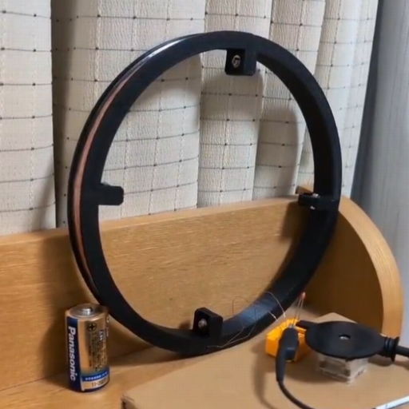
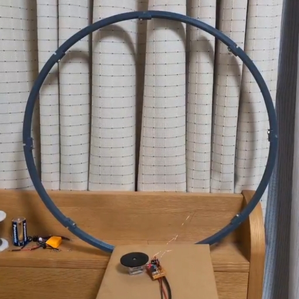
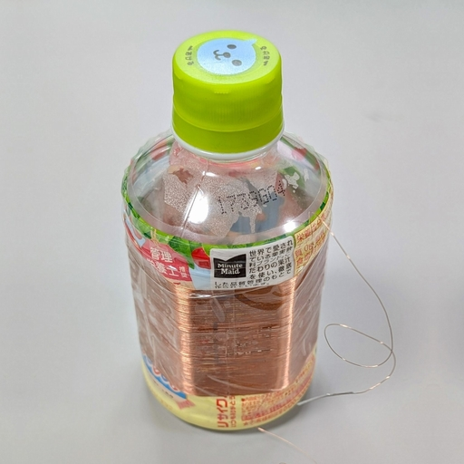

# ラズピコ JJY 受信機 (WIP)

試行錯誤中。

## 構成

恥ずかしながらネットで見つけた構成の切り貼りとカットアンドトライの結果であるため、多分あちこちおかしいと思います。

市販の電波時計でも窓際でないと受信できないような環境なので、ループアンテナとアンプを窓際に配置し、そこから同軸ケーブルで作業机に引っ張っています。

## ループアンテナ (L1/C1)

西日本 (はがね山送信所) の 60kHz に同調するアンテナです。東日本 (おおたかどや山送信所) の 40kHz に同調させるには、L1 の巻数を増やすか、C1 の容量を増やす必要があります。

### 仕様

||ループアンテナ 200mm版|ループアンテナ 400mm版|ペットボトル版|単位|
|:--:|:--:|:--:|:--:|:--:|
|直径|200|400|約65 (※1)|mm|
|巻数|約115|65|約300|turns|
|線径|0.26|0.3|0.18|mm|
|C1容量|1000|1000 + 100|1000 + 470 + 100|pF|

※1) コカ・コーラ社 Qoo 280mL。胴部分は一辺 33mm ほどの六角形

ループアンテナはどちらでも十分安定して受信できました。400mm 版の方が受信強度が強かったのでそちらを使っています。ペットボトル版でも一応受信できましたが、部屋のシーリングライトを消灯しないと信号がノイズに埋もれてしまうなど不安定でした。

### STL

- [loop_antenna_200mm.stl](3dmodel/loop_antenna_200mm.stl)
    - 同じものを 4 個印刷して M3x10 の鍋ネジ x4 で結合
    - 15x15cm のステージで 2 個ずつプリントできます
    - 巻き始め/巻き終わりを引き出す穴や溝がありません
- [loop_antenna_400mm.stl](3dmodel/loop_antenna_400mm.stl)
    - 同じものを 8 個印刷して M3x10 の皿ネジ x8 で結合
    - 15x15cm のステージで 4 個ずつプリントできます

----
