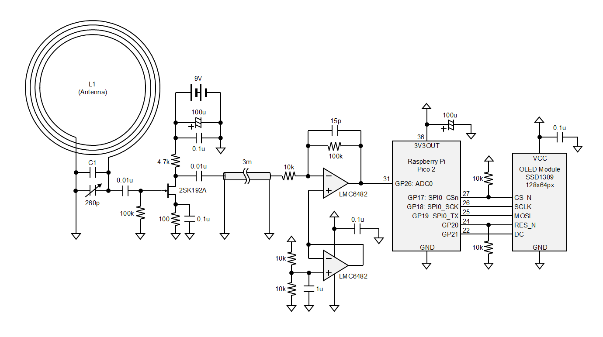

# Raspberry Pi Pico 2 JJY 受信機 (WIP)

試行錯誤中。

## 構成

ネットで見つけた構成の切り貼りとカットアンドトライの結果であるため、多分あちこちおかしいと思います。

市販の電波時計でも窓際でないと受信できないような環境なので、ループアンテナとアンプを窓際に配置し、そこから同軸ケーブルで作業机に引っ張っています。

## ループアンテナ (L1/C1)

### 仕様

どちらでも受信できましたが、400mm 版の方が受信強度が強かったのでそちらを使っています。

||200mm版|400mm版|単位|
|:--:|:--:|:--:|:--:|
|直径|200|400|mm|
|巻数|約115|65|turns|
|線径|0.26|0.3|mm|
|C1容量|1000|1000 + 100|pF|

### STL

- [loop_antenna_200mm.stl](3dmodel/loop_antenna_200mm.stl)
    - 同じものを 4 個印刷して M3x10 の鍋ネジで結合
- [loop_antenna_400mm.stl](3dmodel/loop_antenna_200mm.stl)
    - 同じものを 8 個印刷して M3x10 の皿ネジで結合

----
